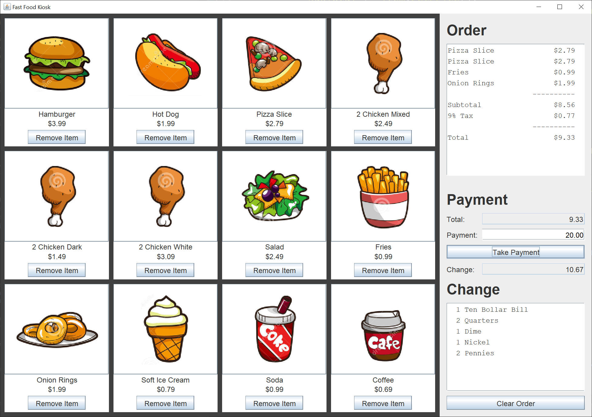
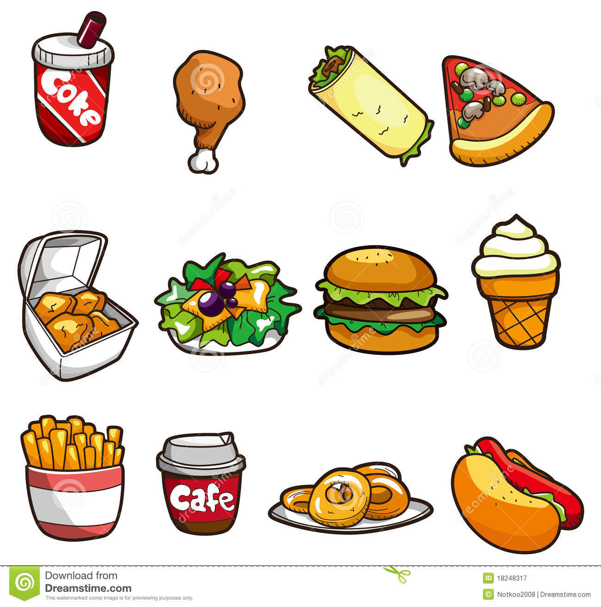

# Fast-food Kiosk

## Introduction

Recently on Stack Overflow, someone asked a question about a fast-food kiosk they were working on.  I made a comment and moved on.  Later, I started thinking about just how intricate a fast-food kiosk GUI would be, so I coded one.

Here's the GUI I coded.  The picture shows what eould be displayed after taking an order.  Even after reducing the pictures by 50%, the GUI is still 1314 x 926 pixels.

The food images are placed on buttons.  To add an item to the order, left-click on a picture.  To remove an item from the order, left-click on the Remove Item button under the picture.  The order receipt is always in main food, side dish, dessert, and drink order, no matter how many items you add and delete from the order.

Once the order is taken, type the amount of money received and left-click the Take Payment button.  You don't have to type a decimal point.  As an example, 20 represents a twenty dollar bill.  The GUI will add the cents after the TakePayment button is left-clicked.

After the customer receives their change, left-click the Clear Order button before taking the next order.

## Explanation

If you’re not familiar with Java Swing, Oracle has an excellent tutorial to get you started, [Creating a GUI With JFC/Swing](https://docs.oracle.com/javase/tutorial/uiswing/index.html). Skip the Netbeans section.

There's more to a kiosk than what I coded.  I focused mainly on the cashier GUI.

When I create a Swing application, I use the [model / view / controller](https://en.wikipedia.org/wiki/Model%E2%80%93view%E2%80%93controller) (MVC) pattern.  This pattern allows me to separate my concerns and focus on one part of the Swing application at a time.

In a Swing GUI, the MVC pattern comes down to three ideas.

1. The view reads from the model.  The view does not update the model.
2. The controller updates the model.
3. The controller repaints / updates the view.

### Model

The first class I created was the Item class. This plain Java getter / setter class contains a String name, an Image image, a int price, and an int orderIndex.  I keep the price in pennies because then I don't have to worry about floating-point rounding errors.  The currency amounts are small enough that an int value is sufficient.  The orderIndex is a field I added later, when I saw what the order recipt looked like after adding and removing several food items.  I decided to keep the order sorted, and the orderIndex is the value I sort the items by.

Here's the original image for the fast-food items.

The next class I created was the Inventory class.  This plain Java getter / setter class contains a java.util.List of Item instances.  The only interesting method in this class is the createItems method.  To get the images, I use the BufferedImage subImage method to copy the image and the Image getScaledInstance method to reduce the image size by 50%.

This class is instantiated one time, in the constructor of the GUI.  Generally, you instantiate the application model, then create the view.

Finally, I created the Order class.  This plain Java getter / setter class contains a java.util.List of Item instances and a double orderTotal.  The order total is a double because we're passing the value from one method to another.

### View

I hope this explanation makes sense.  I wanted to draw a picture, but the draw.io website is so complicated, I couldn't figure out how to draw boxes with text inside.

I used a JFrame.  The JFrame has a BorderLayout default layout.

I placed a kiosk JPanel in the CENTER of the JFrame BorderLayout.

I placed a control JPanel in the AFTER_LINE_ENDS of the JFrame BorderLayout.

#### Kiosk JPanel

The kiosk JPanel contains 12 fast-food selection JPanels.  The kiosk JPanel uses a GridLayout, 4 columns by 3 rows.

Each selection JPanel uses a BorderLayout.  Inside the selection JPanel is an image JButton and a text button JPanel.  The text button JPanel uses a BorderLayout and holds the name of the fast-food item and the Remove Item button.  This nesting of JPanels with a simple layout is one way to create a complex GUI.  With practice, you see JPanels everywhere.

#### Control JPanel

The control JPanel uses a BorderLayout and contains an order JPanel and a payment JPanel.

The order JPanel uses a GridBagLayout.  I could have used a simpler layout, but since I knew I was going to stack the order JPanel and the payment JPanel, I used the GridBagLayout.

The payment JPanel uses a GridBagLayout.

### Controller

The 24 kiosk JButtons share one ActionListener, the OrderListener class.  This class adds or removes items from the Order class.

The Take Payment JButton uses the PaymentListener class for its ActionListener.  This class populates the payment JPanel.

The Clear Order JButton has an anonymous class for its ActionListener, since it just clears the order and the payment.  Both the GUI and the model are cleared.
